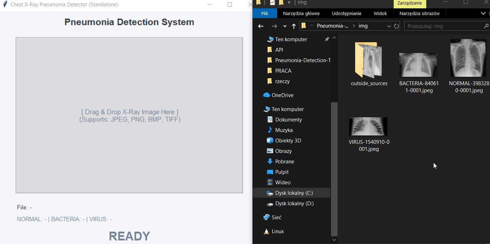
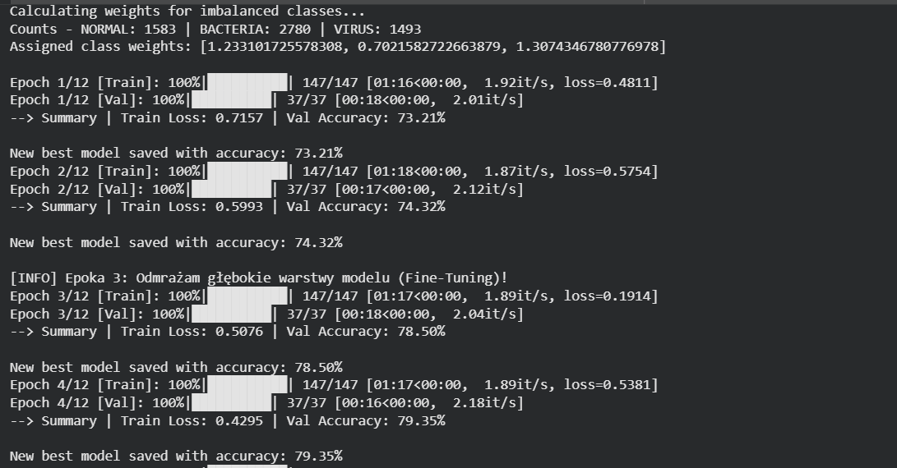
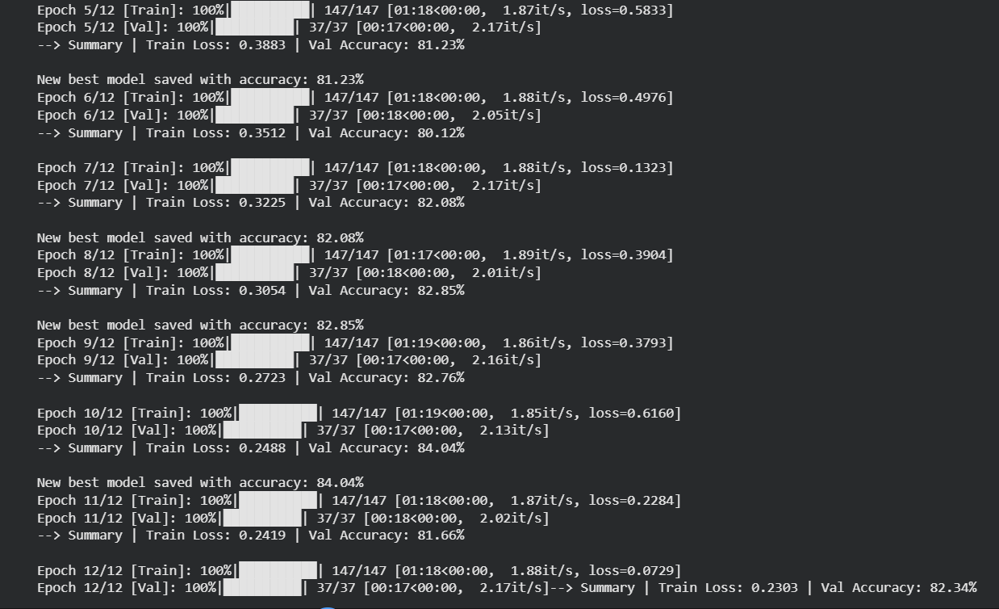

# Chest X-Ray Pneumonia Detection System

Technical documentation for a Deep Learning project utilizing Fine-Tuned EfficientNet-B0 and ONNX Runtime for automated classification of pneumonia types from chest X-ray images.



---

## Table of Contents
1. [Introduction and Project Goal](#1-introduction-and-project-goal)
2. [Project Structure](#2-project-structure)
3. [Dataset and Preprocessing](#3-dataset-and-preprocessing)
4. [Model Architecture & Enhancements](#4-model-architecture--enhancements)
    - [Class Balancing](#class-balancing)
    - [Data Augmentation](#data-augmentation)
5. [Training Strategy and Inference (ONNX)](#5-training-strategy-and-inference-onnx)
6. [Implementation and Tech Stack](#6-implementation-and-tech-stack)
7. [Setup Instructions](#7-setup-instructions)
8. [Performance and Results](#8-performance-and-results)
9. [LLM Usage in the Project](#9-llm-usage-in-the-project)

---

## 1. Introduction and Project Goal

This application is a medical image classification system designed to detect and categorize pneumonia from chest X-ray scans. 

With the increasing workload on medical professionals, automated preliminary diagnosis tools are becoming highly valuable. Distinguishing between viral and bacterial pneumonia is critical for determining the correct treatment path (e.g., prescribing antibiotics). 

The goal of this project was not only to train a highly accurate Deep Learning model but also to deploy it using industry-standard Software Engineering practices. This includes moving away from heavy research environments (PyTorch) into lightweight, production-ready microservices (Docker + FastAPI) and standalone desktop clients (`.exe`), optimized for speed and low memory footprint.

## 2. Project Structure

The repository follows a strict Separation of Concerns (SoC) architecture:

* **`API/`**: Contains the server-side microservice. It houses the lightweight `main.py` (FastAPI), a `Dockerfile` for cloud deployment, and the exported ONNX model.
* **`model/`**: The R&D (Research & Development) directory. It holds all the training scripts, PyTorch logic, model weights (`.pth`), and performance comparison scripts.
* **`standalone_app/`**: An isolated environment containing the "Thick Client" desktop application compiled to a single `.exe` file via PyInstaller.
* **`img/`**: A directory containing test X-ray images
* **`assets/`**: images and gif for this documentation

## 3. Dataset and Preprocessing

The model was trained and evaluated using the publicly available [Labeled Chest X-Ray Images](https://www.kaggle.com/datasets/tolgadincer/labeled-chest-xray-images) dataset from Kaggle. The dataset consists of over 5,800 high-quality chest X-ray scans, categorized into three distinct diagnostic classes:

1. **NORMAL:** Healthy lungs showing no signs of infection or opacity.
2. **BACTERIA:** Lungs exhibiting bacterial pneumonia, which typically requires immediate antibiotic treatment.
3. **VIRUS:** Lungs exhibiting viral pneumonia, requiring supportive care and a different clinical management path.

### Preprocessing Pipeline
To prepare the raw X-ray scans for the EfficientNet-B0 architecture, all images were resized to **224x224 pixels** and normalized using the standard ImageNet mean and standard deviation values (`mean=[0.485, 0.456, 0.406]`, `std=[0.229, 0.224, 0.225]`). 

During the deployment phase, it is crucial to maintain strict preprocessing parity between the research and production environments. By default, `torchvision` (used in training) resizes images using Bilinear interpolation, while the `Pillow` library (used in our standalone `.exe`) defaults to Bicubic. To prevent microscopic confidence drifts between the PyTorch and ONNX engines, `Image.Resampling.BILINEAR` was explicitly enforced in the production code.

```python
img_resized = img.resize((224, 224), resample=Image.Resampling.BILINEAR)
```
## 4. Model Architecture & Enhancements

The core engine is based on **EfficientNet-B0**, a highly optimized Convolutional Neural Network (CNN). To adapt it to this specific medical domain, several critical engineering enhancements were introduced:

### Class Balancing (Mathematical Weighting)
Medical datasets are notoriously imbalanced (e.g., significantly more Bacterial samples than Viral ones). Instead of physically duplicating or deleting images (which risks overfitting or data loss), we modified the `CrossEntropyLoss` function. We introduced a mathematical penalty multiplier, making mistakes on the rare `VIRUS` class "cost" more than mistakes on the common `BACTERIA` class.

```python
class_counts = [0, 0, 0]

    for path in dataset_for_train.image_paths:
        filename = os.path.basename(path)
        label_str = filename.split('-')[0]
        label_idx = dataset_for_train.class_to_idx[label_str]
        class_counts[label_idx] += 1

    print(f"Counts - NORMAL: {class_counts[0]} | BACTERIA: {class_counts[1]} | VIRUS: {class_counts[2]}")

    total_samples = sum(class_counts)
    num_classes = len(class_counts)
    class_weights = [total_samples / (num_classes * count) for count in class_counts]

    weights_tensor = torch.tensor(class_weights, dtype=torch.float).to(device)
    print(f"Assigned class weights: {weights_tensor.tolist()}\n")

    criterion = torch.nn.CrossEntropyLoss(weight=weights_tensor)
    optimizer = torch.optim.Adam(model.classifier[1].parameters(), lr=0.001)
```

### Data Augmentation
To prevent the model from memorizing exact pixel layouts (overfitting) and force it to learn actual lung anatomy, we introduced a "hard teacher" approach. The training dataset applies randomized `RandomRotation(10)` and `ColorJitter(brightness=0.1, contrast=0.1)` on the fly, ensuring the model generalizes well to real-world, imperfect hospital scans.
```python
train_transforms = transforms.Compose([
    transforms.Resize((224, 224)),
    transforms.RandomRotation(10),
    transforms.ColorJitter(brightness=0.1, contrast=0.1),
    transforms.ToTensor(),
    transforms.Normalize(mean=[0.485, 0.456, 0.406], std=[0.229, 0.224, 0.225])
])

val_transforms = transforms.Compose([
    transforms.Resize((224, 224)),
    transforms.ToTensor(),
    transforms.Normalize(mean=[0.485, 0.456, 0.406], std=[0.229, 0.224, 0.225])
])
```
## 5. Training Strategy and Inference (ONNX)

### Fine-Tuning Strategy (Deep Unfreezing)
The training process utilized Transfer Learning. For the first 2 epochs, the entire EfficientNet body was frozen, and only the new 3-class decision head was trained. Starting from Epoch 3, the last 3 convolutional blocks of the network were "unfrozen" (`requires_grad = True`). This allowed the model to fine-tune its deeper feature extractors specifically for X-ray edge detection, resulting in an accuracy boost without destroying the pre-trained weights.

### Model Checkpointing
To avoid overtraining, the training loop saved the `.pth` weights only when the Validation Accuracy reached a new peak (`best_val_acc`), successfully capturing the model at its absolute maximum generalization capability.

### ONNX Export
For production, the PyTorch model was exported to the **ONNX (Open Neural Network Exchange)** format. 
* **Size Reduction:** Eliminated the 2GB+ PyTorch dependency.
* **Speed:** Inference time dropped from ~80ms (PyTorch CPU) to **~7ms** (ONNX Runtime CPU).

### Training settings
Learning duration was set to **12 Epochs**

Learning rate was chosen to be **lr = 0.001** in the 3 starting epochs, and later, after unfreezing the model, it was decreased to **lr = 0.0001**


## 6. Implementation and Tech Stack

The project was developed in **Python 3.11**.

**Core Libraries & Technologies:**
* `torch` & `torchvision`: Neural Network training, augmentation, and Fine-Tuning.
* `onnxruntime`: High-performance, lightweight inference engine.
* `numpy` & `Pillow`: Pure mathematical image preprocessing (bypassing PyTorch in production).
* `FastAPI` & `Docker`: Cloud-ready REST API deployment.
* `tkinterdnd2` & `PyInstaller`: Drag & Drop GUI creation and standalone `.exe` compilation.

## 7. Setup Instructions

### Standalone Desktop Application (.exe)
1. Download `standalone_app.exe` from the **Releases** tab.
2. Run the application (No Python installation required).
3. Drag & Drop any `.jpeg`, `.png`, or `.tiff` X-ray image into the application window.
4. The prediction and confidence scores will appear instantly.

### Docker API Server
To run the lightweight microservice locally:
1. Navigate to the `API/` directory.
2. Build the Docker image: 
   ```bash
   docker build -t xray-api .
   ```
3. Run the container:
   ```bash
   docker run -d -p 8000:8000 --name xray-server xray-api
   ```
4. Check if the interactive API documentation works at `http://127.0.0.1:8000/docs`.
5. Create virtual environment in the project main folder
6. Download packages required to run `client_app.py` (It is **not recommended** to install them from requirements.txt, unsless you want to test .py files from `/model`, as they contain heavy packages like PyTorch)
7. Run `client_app.py`

If you do want to test model code locally, make sure to do one of two things:
1. Make `.venv` on `Python 3.11` or
2. Remove any mentions of directml from the `model.py`

Directml is responsible for computing if you have strong AMD graphic card, but it doesn't work on more modern versions of Python
## 8. Performance and Results

### Final Accuracy
The model achieved a peak Validation Accuracy of **84.04%** at Epoch 10. Considering the small scale of the dataset and the lightweight nature of the base architecture, this proves highly robust generalization on unseen data, effectively avoiding the memorization (overfitting) trap.

**Training Process**





### PyTorch vs ONNX Parity Benchmark
Extensive testing confirmed zero precision loss during the ONNX conversion, with a massive increase in execution speed. The standalone client performs diagnostics in milliseconds.

```text
Evaluating Image: NORMAL
  PyTorch Result: NORMAL   (98.93%) | Time:  41.03 ms
  ONNX Result:    NORMAL   (98.93%) | Time:   8.19 ms

Evaluating Image: BACTERIA
  PyTorch Result: BACTERIA (99.01%) | Time:  79.63 ms
  ONNX Result:    BACTERIA (99.01%) | Time:   7.28 ms

Evaluating Image: VIRUS
  PyTorch Result: VIRUS    (96.21%) | Time:  50.09 ms
  ONNX Result:    VIRUS    (96.21%) | Time:   7.30 ms
```

## 9. LLM Usage in the Project

This project was developed with the assistance of Large Language Models (LLMs), primarily Gemini 1.5 Pro. The model acted as an engineering copilot, assisting in both the architectural design and the coding layer. Its specific contributions include:

* **Architecture Design:** Proposing and structuring the dual-architecture approach (Docker API + Standalone `.exe`).
* **Deployment Optimization:** Providing the code to export the model from PyTorch to ONNX and stripping the heavy PyTorch dependency from the production environment.
* **Debugging:** Identifying and resolving the "Interpolation Hell" issue (the disparity between `torchvision` Bilinear and `Pillow` Bicubic resizing algorithms).
* **UI/UX:** Assisting in writing the clean GUI implementation with Tkinter, including Drag & Drop functionality and image previews.

The entire conversation and prompt history have been documented and are available upon request.